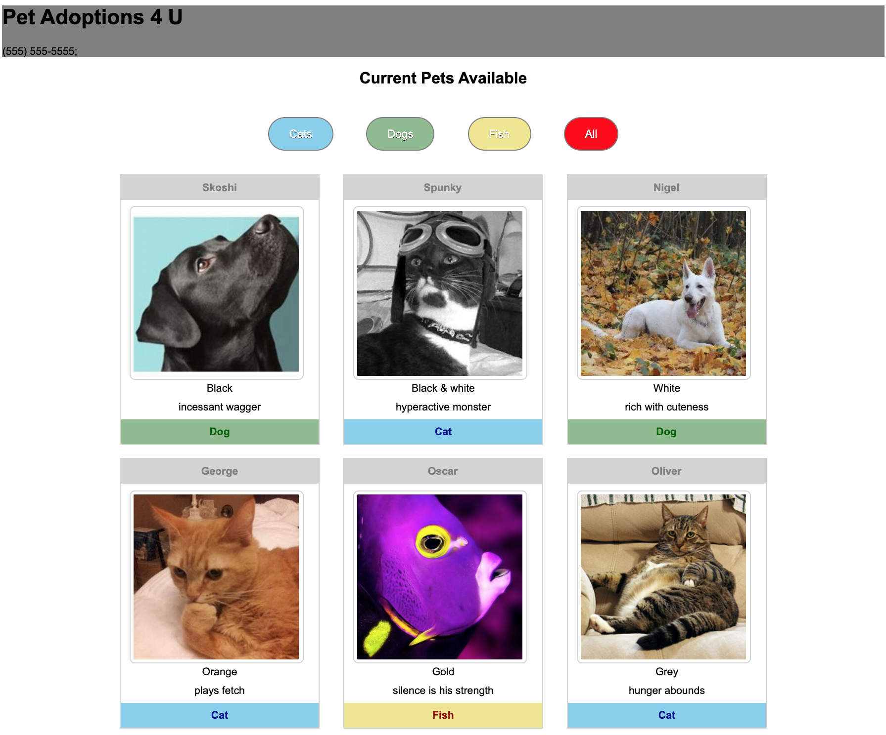

# Pet Adoption
This web app is a simple demonstration of how to display data that is filtered from an array based on buttons clicked by the user. A grid of cards containing pets available for adoption is displayed. As pet category buttons are clicked, the display changes accordingly.

It was built as an exercise to learn how to print to the DOM from a .js file.

## Features
* Buttons and card colors are cordinated with cateogry of pet
* Buttons change color as user hovers on them

## Screenshot

## Installation
* Clone this repo to your local machine using `https://github.com/petestewart72/pet-adoption`
* Run in any http server with `hs`

## Contributors
* [Pete Stewart](https://github.com/petestewart72)

## Technologies Used
  

### Backlog
- [ ] Improve CSS stylization/appearance of page
- [ ] Make filters sticky
- [ ] Change appearance of button to reflect currently active filter(s)
